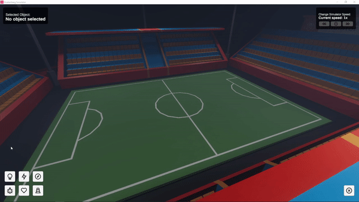

# 🏎️ Braitenberg vehicle simulation

This is an educational and interactive virtual environment in which Braitenberg vehicles live and do their thing. Inside a 3D scene, a user can place lights, obstacles and Braitenberg vehicles. All objects in the scene are interactable. Various object properties, such light intensity for lights or motor strenght for vehicles, are also configurable. Furthermore, a user can slowdown, speedup and pause the simulator.

# :wrench: Installation
The following instructions walks you through the installation process. This can be done in two ways. You can download the lastest build project via [Github Releases](https://github.com/leonardomathon/braitenberg-vehicle-simulation/releases) or you can download the source code and open it in Unity.

## Install via releases
Installing the application is as simple as downloading your preferred version from the [latest release](https://github.com/leonardomathon/braitenberg-vehicle-simulation/releases). Currently, only Windows is supported. If you want to build the application yourself, you have to follow the steps in _install unity project_. On the releases page there are two version to choose from:

- **Windows portable executable** - portable app that does not need to be installed
- **Windows Installer** - installs the simulator at a place of preference.

## Install Unity project
For this installation process, it is assumed you have basic experience setting up Unity Hub and Unity. Note that in order for the project to open correctly, you need to install Unity version `2019.4.19f1`. Newer version might result in bugs.

Once the correct version of Unity is installed, download the source files and place them in a directory of your choice. You can now open Unity Hub, click the `add` button in the `Projects` panel and search for the corresponding directory. If everything is done correctly, the project should open without any errors.

# Acknowledgments
This application was developed by a team of 3 CS master students, namely:

 - [Jorg Bekelaar](https://github.com/jorgbekelaar)
 - [Leonardo Mathon](https://github.com/leonardomathon)
 - [Cas Sievers](https://github.com/cievers)

 It was developed as part of the course `2IMV10 - Visual Computing Project`, taught at Eindhoven University of Technology. 
